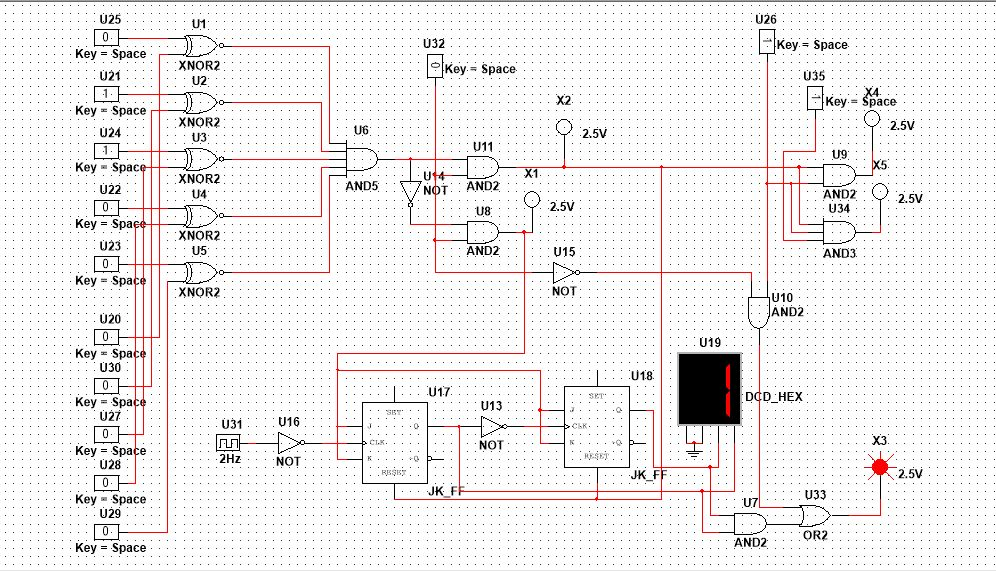

# Digital Password Lock System

## Overview
This is a digital password lock system built using logic circuits.

## Working
- Uses XNOR gates to compare password
- Uses JK flip-flops to store state
- LED shows lock/unlock

## Output
See images below

## Circuit Diagram

